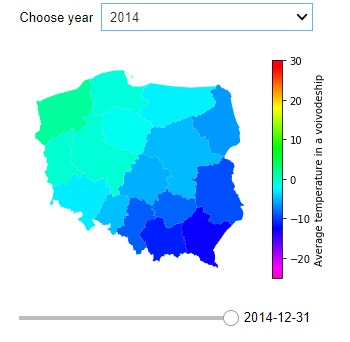

# Climate_change
 The goal of this project is to check whether there is a visible climate change in Poland. It bases on weather data from 
 various meteorological stations from last 70 years. 
 
 The data is available publicly at https://dane.imgw.pl/ and you can find the code to download it in the Get_the_data.ipynb notebook.
 
 The project has two parts:
 * Analysis_snow.ipynb - presents an EDA specifically on snow data.
 * The_map.ipynb - builds a choropleth interactive map with average temperatures in voivodeships throughout the time.

